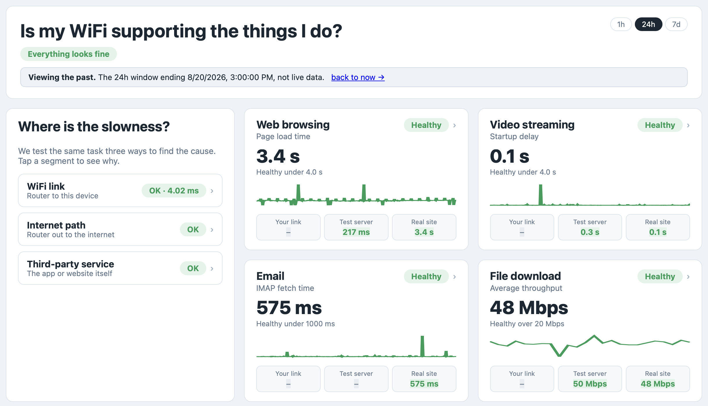
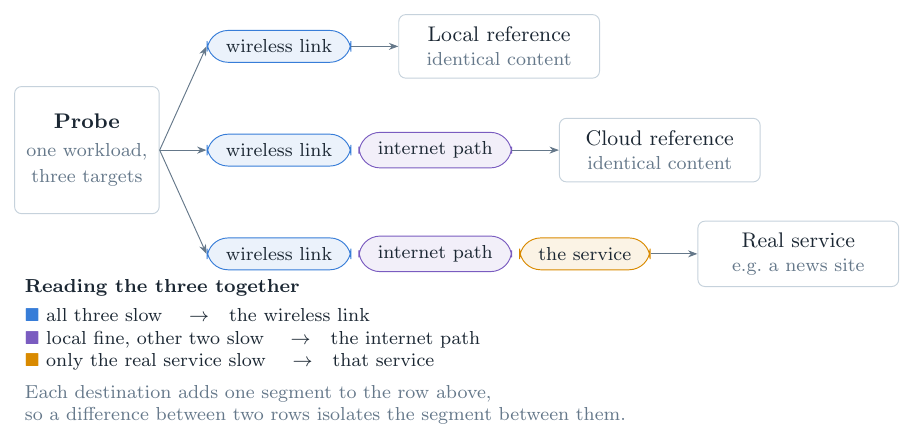
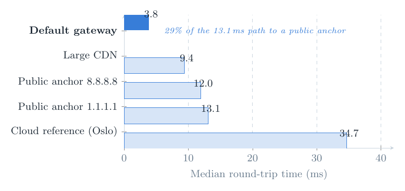
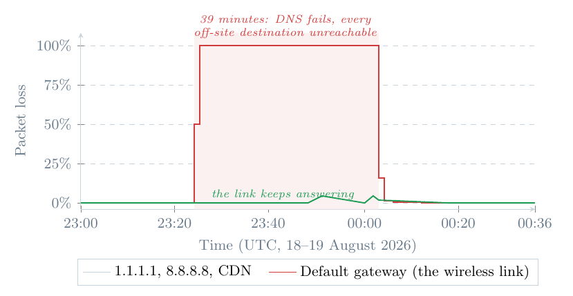
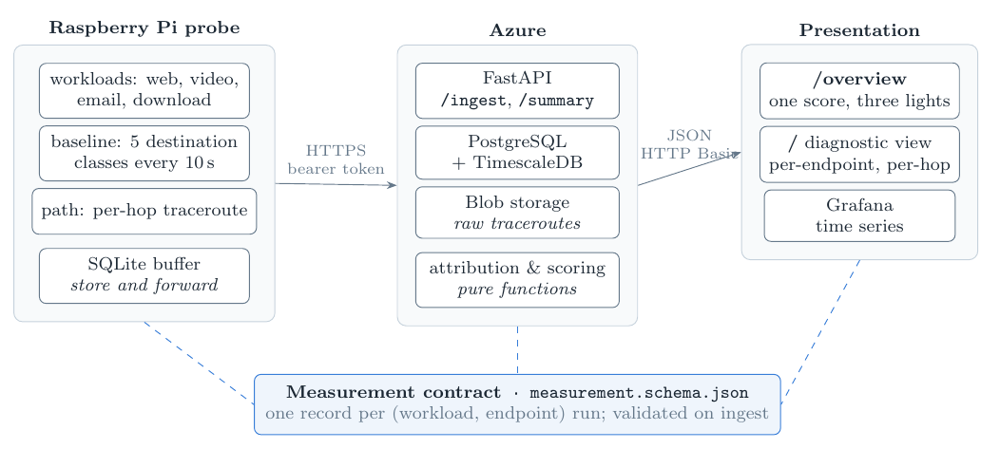
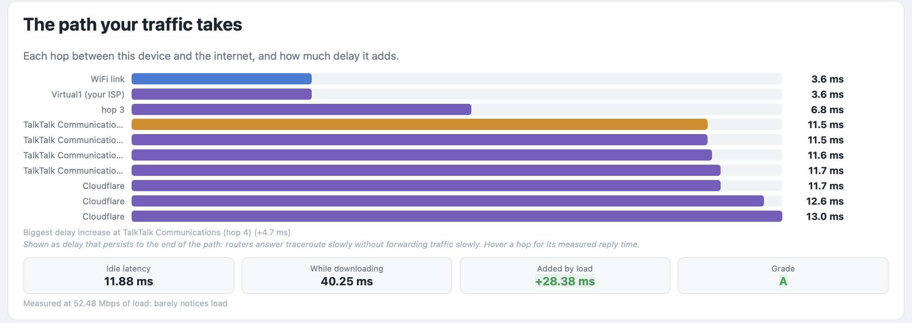

# Remote WiFi Performance Tool

**A Raspberry Pi probe that measures a WiFi network the way a person experiences it, and tells you *where* the slowness is: the wireless link, the building's internet connection, or the service you are using.**

Most WiFi tools report a throughput number. That number does not explain why a video stalled, whether a page will load, or whose fault it is. This project runs real application workloads (a headless-browser page load, a simulated video player, an IMAP fetch, a file download) on a schedule, from an unattended probe, against three destinations at once, and turns the comparison into a plain-language verdict on a cloud dashboard.

Built as an MSc project at the University of Liverpool (COMP702, 2026). It ran unattended in a student accommodation building for 29 days, produced 706,265 measurements, caught a real 39-minute uplink failure and attributed it correctly, and was then tested with deliberately injected faults.

<p align="center"></p>

---

## Contents

- [The idea](#the-idea)
- [What it measures](#what-it-measures)
- [Results from the deployment](#results-from-the-deployment)
- [Architecture](#architecture)
- [Repository layout](#repository-layout)
- [Quick start (everything on one laptop)](#quick-start-everything-on-one-laptop)
- [Deploying to Azure](#deploying-to-azure)
- [Installing the probe on a Raspberry Pi](#installing-the-probe-on-a-raspberry-pi)
- [The dashboards](#the-dashboards)
- [The health score](#the-health-score)
- [The phone client](#the-phone-client)
- [Fault injection](#fault-injection)
- [Analysis scripts](#analysis-scripts)
- [Tests](#tests)
- [The data contract](#the-data-contract)
- [Things that went wrong, and what they taught](#things-that-went-wrong-and-what-they-taught)
- [Limitations](#limitations)
- [Licence and acknowledgements](#licence-and-acknowledgements)

---

## The idea

Every workload runs against three destinations:

| Endpoint | What it is | Path it crosses |
|---|---|---|
| **local** | a wired server on the same LAN serving the reference content | WiFi link only |
| **cloud** | the *same* reference content on a cloud host under project control | WiFi link + internet path |
| **real** | a real third-party service (a news site, a public test file, a mailbox) | WiFi link + internet path + that service |

Each destination adds exactly one segment, so a difference between two rows isolates the segment between them. All three slow: the WiFi link. Local fine, the other two slow: the internet path. Only the real service slow: that service.

<p align="center"></p>

Alongside the workloads, a lightweight **baseline** runs every 10 seconds against five *destination classes* (the default gateway, two public DNS anchors, a large CDN, and the cloud reference), so the wireless link is measured directly and continuously, not inferred.

## What it measures

| Workload | Cadence | How | Reports |
|---|---|---|---|
| Web | 5 min | headless Chromium via Playwright, browser's own Navigation Timing | DNS, connect, TTFB, full load (ms) |
| Video | 5 min | a simulated player draining a 2 s buffer at real time | startup delay, rebuffers, delivery rate, headroom, quality tier |
| Email | 5 min | IMAP fetch from a throwaway mailbox | fetch time |
| Download | hourly | fixed-size file over HTTP | throughput, bytes |
| Latency under load | hourly | TCP-handshake RTT to an anchor while a download saturates the link | idle RTT, loaded RTT, added delay ("bufferbloat"), A to F grade |
| Baseline | 10 s | ICMP (or TCP handshake where ICMP is dropped) to five destination classes, 10 packets each | RTT, jitter, loss, DNS time |
| Path | 5 min | `mtr --tcp -P 443` with reverse DNS and AS lookups | per-hop RTT and loss, hop operator and role, first-hop RTT, bottleneck hop |

Every record also carries WiFi context (SSID, BSSID, channel, RSSI) and CPU temperature, so environmental change shows up in the data rather than confounding it.

## Results from the deployment

29 days at one site, 706,265 records, 99.81% task availability.

**Where the latency is.** The wireless link accounts for 3.8 ms of the 13.1 ms median round-trip to a public anchor, so 29% of the delay is spent before traffic leaves the building. More striking: the link carries most of the *variability*. Its p95/p50 ratio is 1.75, against 1.08 for the anchor. A measurement taken only at the far end would blame the internet for jitter that belongs to the access point.

<p align="center"></p>

**A real fault, diagnosed automatically.** On 18 August the building's uplink failed for 39 minutes. Every off-site destination lost 100% of packets while the default gateway kept answering. The dashboard reported *"Your WiFi is fine, but the internet connection is down"*, with the wireless link green and the internet path red, with no human involved. An automatic scan of all 29 days for that signature returned exactly one episode: this one.

<p align="center"></p>

**Fault injection.** Six deliberately injected faults (`tc netem` delay, loss and throttling, scoped to specific destinations) were scored against expectations written down beforehand. Four of six were attributed correctly. The exercise also exposed three defects in the analysis code that a month of live operation had not, one of which made the diagnosis non-deterministic. All three are fixed and unit-tested; the two remaining failures are documented limitations of fixed thresholds (see [Limitations](#limitations)).

## Architecture

<p align="center"></p>

Three tiers, one contract. The **probe** (Python on a Raspberry Pi 4, `systemd` service) runs workloads, writes every record to a local SQLite buffer, and uploads with retry and backoff, so a cloud outage costs nothing but delay. The **backend** (FastAPI on Azure App Service) validates each record against the JSON Schema on ingest, stores it in PostgreSQL with the TimescaleDB extension, sends large payloads (full traceroute reports) to Blob Storage, and computes attribution and the health score server-side as pure functions. The **presentation** layer is two hand-written pages (an end-user overview with one score and three traffic lights, and a per-endpoint, per-hop diagnostic view) plus a Grafana time-series board provisioned from JSON.

All intelligence about *what the numbers mean* lives in one place, `cloud/app/summary.py`, so the two pages, and the phone client, cannot disagree.

Every query endpoint accepts `?at=<ISO instant>` so a window can end in the past. A finished incident is invisible from the present; this is how the outage above was reconstructed, and how the screenshots in this README were taken after the deployment ended.

## Repository layout

```
.
├── contracts/measurement.schema.json   the data contract every component is written to
├── probe/                Raspberry Pi client
│   ├── workloads/        web.py, video.py, email.py, download.py, baseline.py, path.py, loadlat.py
│   ├── scheduler.py      APScheduler cadences; parallel baseline classes
│   ├── buffer.py         SQLite store-and-forward (WAL)
│   ├── uploader.py       HTTPS upload, bearer token, retry/backoff
│   ├── context.py        SSID/BSSID/channel/RSSI/CPU temperature
│   ├── netid.py          truncated SHA-256 of the public IP (never stored raw)
│   ├── captive_portal.py drives Chromium through click-through portals; systemd timer
│   ├── probe.service     systemd unit
│   └── update.sh         pull and restart on the Pi
├── reference/            nginx image serving identical content locally and in the cloud
├── cloud/
│   ├── app/              FastAPI: /ingest, /summary, /measurements, /sites, /overview, /
│   │   └── summary.py    attribution, availability, health score (pure functions)
│   └── db/               SQLAlchemy models, Alembic migrations, Timescale hypertable
├── dashboard/
│   ├── summary/          index.html (diagnostic view), overview.html (end-user view); no frameworks
│   └── grafana/          datasource and dashboard JSON, provisioned at start
├── infra/                Bicep template for the whole Azure stack; deploy.sh for redeploys
├── mobile-ios/           the phone as a second probe class (Swift, SwiftUI)
├── tests/
│   ├── test_*.py         58 unit tests
│   ├── fault-injection/  inject.sh (8 tc netem scenarios), analyse.py (pre-registered scoring)
│   └── analysis/         deployment.py: resumable aggregation of the whole dataset
├── docker-compose.yml    reference + Postgres/Timescale + API + Grafana on one machine
└── pyproject.toml
```

## Quick start (everything on one laptop)

Requires Python 3.11+, Docker, and `mtr` on the PATH.

```bash
git clone https://github.com/Selimgul14/network-quality-analysis.git
cd network-quality-analysis
cp .env.example .env                    # defaults point everything at localhost

pip install -e ".[dev]"
playwright install chromium             # for the web workload

docker compose up -d                    # reference server :8080, Postgres, API :8000, Grafana :3000
python -m probe.main                    # run the probe in the foreground
```

Then open:

- `http://localhost:8000/` the diagnostic dashboard
- `http://localhost:8000/overview` the end-user view
- `http://localhost:3000` Grafana (`wifi` / `wifi` in the compose stack)

With the compose stack, "local" and "cloud" are the same container, so the two rows will agree; the interesting behaviour appears once the cloud endpoint is really remote.

## Deploying to Azure

One Bicep template creates everything: two App Services (backend, reference content), a third for Grafana, Azure Database for PostgreSQL Flexible Server with TimescaleDB preloaded, and a storage account. Full notes in [`infra/README.md`](infra/README.md).

```bash
# 1. Build and push the three images (they must be linux/amd64; add --platform linux/amd64 on Apple Silicon)
docker build -t <you>/wifi-ref:latest reference/
docker build -t <you>/wifi-api:latest -f cloud/Dockerfile .
docker build -t <you>/wifi-grafana:latest dashboard/grafana/
docker push <you>/wifi-ref:latest && docker push <you>/wifi-api:latest && docker push <you>/wifi-grafana:latest

# 2. Deploy
az group create -n wifi-rg -l <region>
az deployment group create -g wifi-rg -f infra/main.bicep \
  -p adminPassword=<db-password> ingestToken=<random-token> dashPassword=<dashboard-password> \
     registry=docker.io/<you> clientIp=<your-ip>

# 3. Redeploy after a code change
./infra/deploy.sh api grafana           # any subset of: api ref grafana
```

The backend container runs the Alembic migrations on start, so a redeploy is also an upgrade. `deploy.sh` checks the pushed manifest is amd64 before restarting anything, because App Service will accept an arm64 image and then fail to run it.

Cost on the lowest working tiers is roughly GBP 25 to 30 a month. `az group delete -n wifi-rg` removes all of it.

## Installing the probe on a Raspberry Pi

Raspberry Pi OS Lite 64-bit, joined to the target network over WiFi (that link is the thing being measured).

```bash
sudo apt install -y git python3-venv mtr-tiny ffmpeg iw
sudo mkdir -p /opt/probe && sudo chown $USER /opt/probe
git clone https://github.com/Selimgul14/network-quality-analysis.git /opt/probe && cd /opt/probe
python3 -m venv .venv && .venv/bin/pip install -e .
.venv/bin/playwright install --with-deps chromium

cp .env.example .env                    # set PROBE_INGEST_URL, PROBE_INGEST_TOKEN, PROBE_CLOUD_BASE,
                                        # PROBE_SITE, and PLAYWRIGHT_BROWSERS_PATH=/opt/probe/ms-playwright
.venv/bin/python -m probe.main          # watch one full cycle in the foreground first

sudo cp probe/probe.service /etc/systemd/system/
sudo systemctl enable --now probe
journalctl -u probe -f
```

Leave `PROBE_LOCAL_BASE` empty if there is no wired reference server; the local endpoint is then omitted rather than recorded as failures. `probe/captive-portal.service` and its timer handle click-through captive portals automatically, which is what made an unattended month at a student residence possible. `comitup` is recommended for headless WiFi onboarding between sites.

Two things learned the hard way, both handled in the setup above: the service runs as root while Playwright installs browsers per user, so `PLAYWRIGHT_BROWSERS_PATH` must be pinned; and `Restart=always` protects against a crash but not a crash loop, so add an external freshness check on `/summary` if nobody is watching the dashboard.

## The dashboards

Two layers, one analysis.

**`/overview`** is for the person who owns the network: one score out of 100, one sentence, three traffic lights (your WiFi, the internet path, the services you use), and the five component bars. During the 18 August outage it read *"The WiFi is fine. The path from the router out to the internet is the slow part. 56.5% of tasks completed. Scored 93 while working, 53 overall."*

**`/`** is the diagnostic view: each workload as a card with its per-endpoint medians and trend; the *where is the slowness?* panel with a plain-English explanation and evidence per segment; the path panel naming each hop's operator (from reverse DNS and AS lookups) with per-hop delay smoothed so it reads as delay the traffic pays rather than as slow traceroute replies; the bufferbloat readout; and a compare-networks table across sites.

<p align="center"></p>

Both pages are plain HTML, JavaScript and inline SVG, no frameworks. Both accept `?at=` to replay any past window.

## The health score

Each workload's median is mapped to a 0 to 100 quality index anchored on the five-point MOS scale of ITU-T P.800: the workload's *good* threshold maps to MOS 4 (75) and its *poor* threshold to MOS 2 (25), linear between, saturating beyond. Five components are combined by a weighted mean:

| Component | Weight | Input | Why |
|---|---|---|---|
| Video | 0.35 | startup delay, rebuffering | rebuffering has the largest measured effect on viewer engagement of any quality metric (Dobrian et al., SIGCOMM 2011) |
| Responsiveness | 0.25 | added delay under load, loss | latency under load is what interactive use experiences (Sundaresan et al., SIGCOMM 2011) |
| Web | 0.25 | page load | the most frequent interactive task |
| Download | 0.10 | throughput | bulk transfer tolerates delay: ITU-T G.1010 gives it 15 s preferred, 60 s acceptable |
| Email | 0.05 | IMAP fetch | short, infrequent, rarely waited on |

Missing components are renormalised away. The reported score is `quality × availability`, where availability is the share of application tasks that completed at all. Without that term a median cannot see a failed run: a window straddling the outage recovery scored 93 "excellent" beside "not responding". With it, 53.

Thresholds were engineering estimates and were checked against the 29-day distribution afterwards; the web and link thresholds sit near p95 (good), the download threshold never fires on this network, and the bufferbloat threshold sits on the median (miscalibrated). This is reported rather than silently retuned.

## The phone client

`mobile-ios/` is an iOS app that is a *probe*, not a viewer: it runs the same workloads against the same three endpoints, posts the same records to the same backend, and asks the same `summary.py` what they mean. It was added late in the project without a single change to the data contract, which is the strongest evidence the contract-first design was right.

Four runs on the deployment network while the Pi was also collecting gave a side-by-side comparison: the two agree on the verdict and on the controlled reference, and disagree on wireless-link delay (13 to 16 ms on the phone against 3.8 on the Pi; phone radios power-save), page load (a mobile page, a different engine) and bufferbloat. Same scorer, different instruments. See [`mobile-ios/README.md`](mobile-ios/README.md).

## Fault injection

`tests/fault-injection/inject.sh` applies one of eight impairments on the probe itself with `tc netem`, scoped by destination so that a fault anywhere on the path can be emulated from one device: delaying everything *except* the gateway is indistinguishable, from the probe's point of view, from a fault in the building's uplink. Each scenario relabels the probe's site so its records are separable, and arms a watchdog that clears the impairment whether or not the operator is still connected (scenario 07 cuts the SSH session too).

```bash
sudo ./tests/fault-injection/inject.sh list
sudo ./tests/fault-injection/inject.sh run 05        # +150 ms to everything except the gateway
sudo ./tests/fault-injection/inject.sh matrix         # all eight, unattended
python3 tests/fault-injection/analyse.py --user wifi --password ...   # score against pre-registered expectations
```

## Analysis scripts

`tests/analysis/deployment.py` walks the whole deployment through the query API in 24-hour windows, aggregates as it goes (reservoir sampling for percentiles), caches to disk so it can resume, and prints the dataset shape, the latency decomposition by destination class, loss, diurnal variation, availability, and an automatic scan for the outage signature (gateway answering, everything off-site failing).

```bash
python3 tests/analysis/deployment.py --password ... --days 40
python3 tests/analysis/deployment.py --report          # from cache only
```

## Tests

```bash
pytest -q          # 58 tests; two skip themselves where Chromium or raw sockets are unavailable
```

`test_summary.py` (26 tests) covers attribution, thresholds, the score, availability, the outage states, and each of the three defects fault injection exposed, reproduced on the exact data shape that exposed it. The scoring logic is pure functions over lists of dicts, with no database, which is what made that possible.

## The data contract

`contracts/measurement.schema.json` defines one record per (workload, endpoint) run. Every field outside the required core is nullable, so a record from an early probe version remains valid after the contract grows, and a second probe class could be added without touching it.

```json
{
  "ts": "2026-08-18T23:31:04Z", "probe_id": "pi-maple-01", "site": "example-site",
  "run_id": "…", "workload": "baseline", "endpoint": "local", "target": "10.93.0.1",
  "ok": true, "error": null,
  "metrics": {"rtt_ms": 3.9, "jitter_ms": 0.4, "loss_pct": 0.0, "dns_ms": 12.1},
  "context": {"ssid": "…", "bssid": "…", "wifi_channel": 36, "rssi_dbm": -58, "cpu_temp_c": 51.2},
  "raw_ref": null, "net_hash": "a3f9…"
}
```

The public IP is stored only as a truncated hash. No other client's traffic is ever observed; the probe measures its own.

## Things that went wrong, and what they taught

Seven times the system reported a network problem that did not exist, or failed to report one that did. Each time the data was correct and the collection, aggregation or display was wrong:

1. **A constant 20% packet loss** that was `ping -c 5 -w 5` counting its own deadline as a lost packet. True loss: 0.33%.
2. **A loss panel full of full-height bars**: five-packet runs quantise loss to 20% steps; drawn as points, one lost packet is a spike. Fixed by averaging per interval.
3. **Averaging did not help** until the bucket held enough runs; a 15-minute floor made the plot converge.
4. **A line drawn across a day of missing data** when the probe itself was down. Panels now break on gaps.
5. **A median cannot see a failed run**: a window straddling an outage scored 93. Hence the availability term.
6. **A median cannot see 5% loss**: with ten packets per run, 60% of runs lose nothing, so the median is zero. Loss is now averaged.
7. **A phone reporting every router silent**: on Darwin a datagram ICMP socket delivers the IPv4 header ahead of the ICMP header, and the parser read the wrong offset.

The common shape: a statistic or a rendering applied to data whose structure did not suit it, producing an artefact indistinguishable from a real fault. A measurement tool has to be validated at both ends. Most of these were found by distrusting a number that looked too regular, and the last two by deliberate fault injection rather than by observation.

## Limitations

- **No local reference server at the deployment site.** The building's WiFi enforced client isolation, so the three-way comparison ran as a two-way comparison in production and the wireless link was judged by the direct gateway probe (latency and loss) rather than a like-for-like workload.
- **Fixed absolute thresholds.** Two injected faults were misattributed because a light reference page absorbed 150 ms of added delay while a heavy real page crossed its threshold, and because 5% loss degrades no application workload measurably. Comparing each endpoint against its own recent baseline, and letting the baseline classes vote, would fix both; the data to do it is collected.
- **One site, in vacation.** The diurnal pattern was flat because the building was nearly empty. The tool is designed to compare networks; its strongest use is several sites, or one site across term and vacation.
- **Credentials.** The ingestion token is a shared secret. Distributing the phone client would need per-device credentials and fresh ethics approval, because it would collect data from other people's devices.

## Licence and acknowledgements

MIT, see [`LICENSE`](LICENSE).

Developed by Selim Gul as an MSc Advanced Computer Science project at the University of Liverpool, supervised by Prof. Alan Marshall. Third-party components: [Playwright](https://playwright.dev/python/), [yt-dlp](https://github.com/yt-dlp/yt-dlp), [mtr](https://www.bitwizard.nl/mtr/), [FastAPI](https://fastapi.tiangolo.com/), [TimescaleDB](https://www.timescale.com/), [Grafana](https://grafana.com/), [comitup](https://davesteele.github.io/comitup/), and Azure Bicep. Per-hop operator names come from the [RIPEstat](https://stat.ripe.net/) API.
